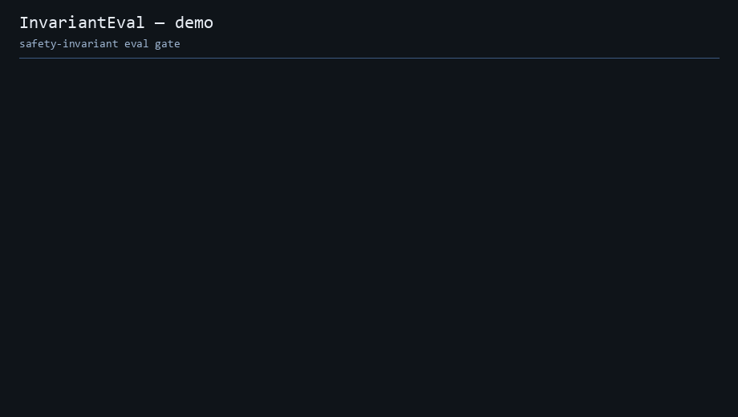

# InvariantEval

**Safety-invariant evals for high-stakes structured AI.** It catches a model auto-filling a field that a human is supposed to own, and the whole loop runs on your machine with a local judge.

<p align="center">
  
  
  
  
  
  
</p>

<p align="center">
  
</p>

## The problem, in one paragraph

Generic eval tools (Braintrust, Langfuse, DeepEval) measure whether output is accurate. They have no concept of an invariant that must never be violated, and they do not distinguish a value a human entered from a value the model volunteered. In domains where being wrong is dangerous (field inspections, insurance claims, compliance records), the failure that actually ships is not low accuracy. It is a model quietly filling in a pass/fail field that a human was supposed to confirm, at high confidence, where a demo would have looked fine. InvariantEval is built to catch exactly that, and to block it before it merges.

## See it block a regression (2 minutes, no GPU)

```bash
pip install -e ".[dev]"

# Good run: the model stays out of fields a human must own. Passes.
invarianteval run examples/fire-inspection-extraction/suite.yaml \
  --provider fixture \
  --fixtures examples/fire-inspection-extraction/fixtures/good \
  --fail-on-invariant

# Regressed run: the model starts auto-filling the locked pass_fail_result on panel-001.
# Exits non-zero. This is the gate doing its job.
invarianteval run examples/fire-inspection-extraction/suite.yaml \
  --provider fixture \
  --fixtures examples/fire-inspection-extraction/fixtures/regressed \
  --fail-on-invariant
```

If you did not install the package, `python -m invarianteval.cli ...` is equivalent.

The `fixture` provider replays recorded model outputs, so the demo is fast, deterministic, and needs no model running. That same property is what makes the gate safe to run on every change (see below).

## Why this is not circular (the part that matters)

The lazy way to build a "never auto-filled" check is to have the harness label a field `ai_suggested` and then assert that it is `ai_suggested`. That proves nothing, because the tool is grading a label it invented.

InvariantEval **derives** provenance instead of stipulating it. For each field it compares three things against a declared per-field policy:

- `model_parsed`: the model's raw, parsed output
- `final_output`: the system's actual final output
- `human_confirmed`: any recorded human confirmations

A value counts as model-originated when the final value is the one the model produced. `never_auto_filled(field)` fails when a field your policy marks as **locked** carries a model-originated value that no human confirmed.

So the regressed run blocks for a real reason: the model started volunteering `pass_fail_result` on `panel-001`, the deriver observed that exact value appearing in the raw model output for a locked field, and the gate caught it. Nothing in the harness decided the outcome in advance. Flip the model back to leaving that field alone and the same run passes. That asymmetry, good passes and only the regressed run fails, is the proof the check is doing real discrimination rather than reading a label it stamped itself.

## Give your coding agent a declared safety gate

Your agent can enforce **your declared** invariants before it finalizes structured output. InvariantEval is not accuracy scoring and it does not rewrite output for you. The honest claim: your agent runs your declared safety rules on every output and **refuses to finalize** when a locked field was model-auto-filled.

**Agent skill** (Cursor or Claude Code):

```bash
cp -r agent-skill/invarianteval ~/.cursor/skills/invarianteval
```

**MCP tool** (stdio server, two tools: `check_invariants` and `list_invariants`):

```bash
pip install -e ".[mcp]"
```

Register `invarianteval-mcp` in your MCP config. See [docs/mcp.md](docs/mcp.md) for registration and example payloads using the fire-inspection suite.

## The safety-invariant assertions

These are the differentiator. They are deterministic, so they never flake.

- **`never_auto_filled(field)`** — a policy-locked field must not carry a model-originated value unless a human confirmed it. This is the headline.
- **`provenance_required(field, allowed)`** — every value for a field must carry provenance from an allowed set (for example, `human_entered` or `ai_confirmed_by_human`).
- **`schema_faithful(schema)`** — the output contains no keys outside the declared schema and populates nothing the schema disallows. Optional `mode: grounded` fails when a field value has no supporting substring or source span in the input.
- **`equivalence_preserved(rule)`** — a declared equivalence relation over named fields must hold in the output (`equal`, `one_of`, `implies`, `numeric_tolerance`).
- **`confidence_gated(field, threshold)`** — a value below the confidence threshold must be routed to review, not emitted as final.

There is also a **judge** tier (LLM-as-judge with a rubric, defaulting to a local Ollama model). It is deliberately a supporting signal and warns rather than blocks, because a small local judge is noisy and a noisy check has no business hard-failing a release. The deterministic invariants are what gate; the judge advises.

## Run it as a local release gate (no CI service required)

The gate is a local script, by design. It needs no hosted runner and no GPU in CI, and it stays deterministic because it runs against recorded fixtures.

```bash
# Unix
scripts/run-gate.sh

# Windows
powershell -File scripts/run-gate.ps1
```

The gate runs the core test suite first (`pytest` on the library only), then replays good and regressed fixtures. Wire it as a pre-push git hook and a regression on a locked field cannot be pushed:

```bash
echo 'scripts/run-gate.sh' > .git/hooks/pre-push
chmod +x .git/hooks/pre-push
```

Platform tests are opt-in: `pip install -e ".[dev,platform]" && pytest tests/platform`.

## Providers

- **`fixture`** (default for the demo and the gate): replays recorded model outputs. Deterministic and offline.
- **`ollama`**: local completion and local judge, using Ollama's structured-output `format` parameter for schema-constrained extraction. Nothing leaves your network.
- **`openai`**: opt-in via `OPENAI_API_KEY`, used only when explicitly configured or as a fallback target.

## How a run is structured

A suite (`suite.yaml`) pins three things for reproducibility: the data snapshot, the model version, and the sampling seed. Each case declares its assertions. The runner produces a `Run` artifact (JSON) carrying per-field provenance traces, assertion results, and cost and latency. `invarianteval report runs/<id>.json -o report.html` renders a self-contained HTML report (no server, no build step).

Turn a production failure into a pinned regression test:

```bash
invarianteval add-case \
  --from-run runs/<id>.json \
  --case-id panel-001 \
  --suite-path examples/fire-inspection-extraction/suite.yaml \
  --fixtures-out examples/fire-inspection-extraction/fixtures/pinned
```

## Beyond the core engine (optional, self-hosted)

The library is the product. It also extends into a self-hosted control plane for teams that want one: a FastAPI server with run storage, an online-eval worker that samples production traces and runs the invariants in **warn-only** mode (production is never hard-blocked), OpenTelemetry trace ingestion that turns production failures into pinned cases, a React dashboard, and pytest and DeepEval adapters. All self-hosted, SQLite by default, no managed billing. Lead with the wedge; the platform is the supporting act.

```bash
pip install -e ".[platform]"
invarianteval server init && invarianteval server run   # API :8000
# docker compose up  →  API + worker + dashboard
```

See [docs/architecture.md](docs/architecture.md), [docs/otel-ingest.md](docs/otel-ingest.md), and [docs/online-eval.md](docs/online-eval.md).

## Why I built this

This pattern came out of shipping a fire-protection inspection product, where a pass/fail result can never be auto-filled at any confidence, cross-brand device equivalence has to hold, and signed records are immutable. Those are not accuracy metrics, they are invariants that must never break, and no general eval tool encodes them. InvariantEval is that idea, generalized and hardened into something any high-stakes extraction pipeline can use.

## Roadmap

- Richer online-eval alerting
- Dashboard gate-status view wired to the API
- Postgres-backed deploy profile for heavier self-hosted installs

## License

MIT.
